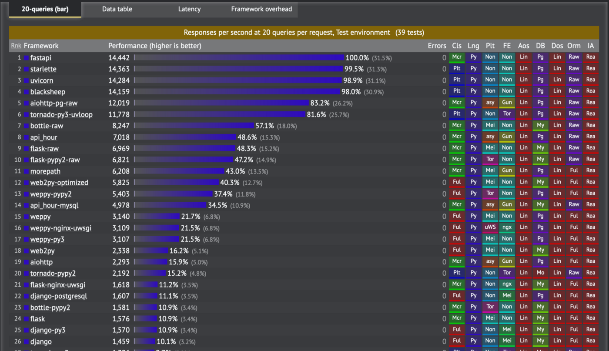

# Что такое FastAPI?

**FastAPI** — это современный, быстрый (высокопроизводительный) веб-фреймворк для создания API-интерфейсов на Python.  

Ключевые особенности фреймворка:
- **Производительный**: Очень высокая производительность, на уровне NodeJS и Go (благодаря Starlette и Pydantic). Один из  
самых быстрых доступных фреймворков Python.
- **Быстрый кодинг**: увеличивает скорость разработки API примерно на 200-300%.
- **C ним меньше ошибок**: уменьшает примерно 40% ошибок, вызванных человеком (разработчиком). 
- **Интуитивно понятный**: отличная поддержка редакторов (IDE). Автозавершение кода везде где только можно. А сам фреймворк  
требует меньше времени на отладку и поиск ошибок благодаря **Pydantic**.
- **Простой**: Разработан, чтобы быть простым в использовании и обучении.
- **Короткий**: сводит к минимуму дублирование кода.
- **Надежный**: легко получить готовый к работе код. Автоматически генерирует интерактивную документацию вашего **API**.
- **Следует стандартам**: основан и полностью совместим с открытыми стандартами для **API**: **OpenAPI** (ранее известный  
как **Swagger**) и **JSON Schema**.

А вот таблица с бенчмарком, которая отображает производительность фреймворков, которые используются для создания API:

Как видно - **FastAPI** в топе и по производительности опережает всех известных конкурентов, а основных - **Flask** и **Django**  
аж в несколько раз.
